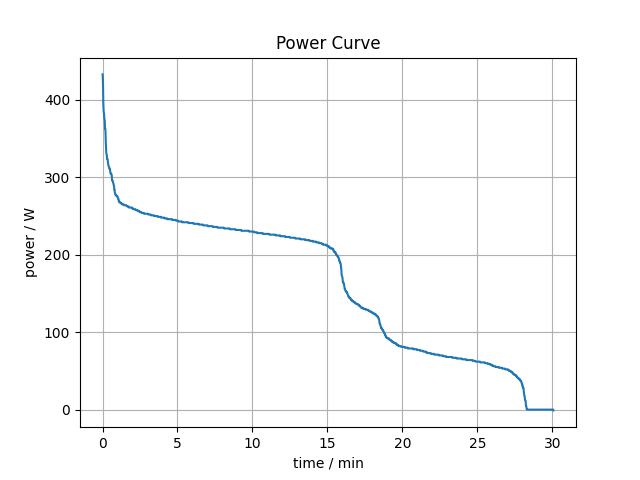
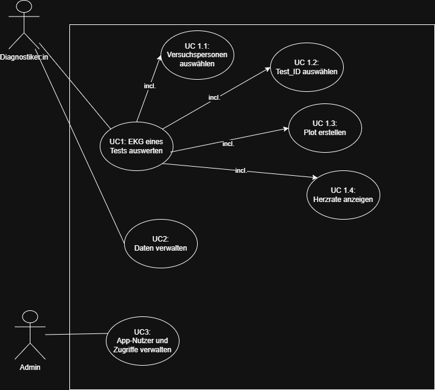

## PUE_GruppeA_Ida

Dies ist ein Projekt für die Lehrveranstaltung Programmierübung 2. Ziel der ersten Aufgabe ist es, eine sogenannte Power-Curve zu erstellen, als Abbildung zu exportieren und diese anschließend auf Sakai abzugeben.

## Projektbeschreibung

Eine Power-Curve zeigt an, wie lange eine bestimmte Leistung beim Radfahren aufrechterhalten werden kann. Dabei handelt es sich nicht um eine zeitliche Darstellung, sondern um eine nach der Leistungshöhe sortierte Kurve. In dieser Aufgabe wurde eine vereinfachte Version der Power-Curve umgesetzt, bei der die Leistungsdaten lediglich sortiert und grafisch visualisiert werden.

## Funktionsumfang

Das Skript 'power_curve.py' liest die Leistungsdaten aus der Datei 'data/actiivity.csv' ein, sortiert sie mithilfe eines selbst implementierten Bubble-Sort-Algorithmus (in 'sort.py') und erstellt anschließend eine Grafik der sortierten Werte. Die erzeugte Abbildung wird im Verzeichnis 'figures' unter dem Namen 'power_curve.png' gespeichert.

## Anforderungen und Nutzungen

Um das Projekt auszuführen, muss das Git-Repository zunächst lokal geklont werden. Anschließend werden mithilfe von PDM alle benötigten Abhängigkeiten installiert, indem im Projektverzeichnis der Befehl 'pdm install' ausgeführt wird.
Nach erfolgreicher Installation kann das Skript 'power_curve.py' gestartet werden. Dieses Skript liest die Leistungsdaten aus der Datei data/activity.csv, sortiert sie mit einem selbst implementierten Bubble-Sort-Algorithmus und erstellt daraus eine vereinfachte Power-Curve.
Die resultierende Grafik wird im Verzeichnis 'figures' unter dem Namen power_curve.png gespeichert.

## Sakai Abgabe 1 - Power Curve
In folgender Graik ist die erstellte Power-Curve zu sehen.

# EKG App

## Funktionsbeschreibungen

## Funktionsbeschreibung
Die App soll __Diagnostiker:in__ ermöglichen, EKG_Daten verschiedener Patienten zu erfassen, zu speicher und auszuwerten. Die App soll eine einfache und intuitive Benutzeroberfläche bieten, um die Bedienung zu erleichtern.
Der __Admin__ kann __Diagnostiker:in__ anlegen.

### Use Case

- UC1: EKG-Daten eines Tests auswerten
    - UC1.1: Versuchspersonen auswählen (included)
    - UC1.2: Test_ID auswählen
    - UC1.3: ...

- UC2: Daten verwalten

- UC3: App Nutzer und Zugriffe verwalten

## Implementierung
__Use Case__ Die User Journey für die Diagnostiker:in wenn sie einen TEst auswerten möchten, folgt aus dem Activity Diagramm:

### Design 

Hier folgen erste Entwürfe eines UI Designs. Des Design ist für die Darstellung auf einem PC optimiert (Queerformat). Keine separaten Frames.

### Datenbank

# EKG App - Streamlit Anwendung
Die App dient zur Visualisierung von EKG-Daten und wurde als Streamlit-Anwendung für die Sakai-Abgabe 2 entwickelt.

## Anwendung starten
'streamlit run main.py'
Nach kurzer Ladezeit öffnet sich automatisch ein Browserfenster mit der App-Oberfläche. Falls Änderungen am Code vorgenommen werden, müssen diese gespeichert und die Streamlit-Seite im Browser neu geladen werden.

## Funktionsweise der EKG APP

### Auswahl der Versuchsperson
Zu Beginn wird der Name der Versuchsperson ausgewählt. Anschließend erscheint das zugehörige Bild der Person.
### Eingabe der maximalen Herzfrequenz
Diese kann manuell eingegeben oder über Plus-/Minus-Buttons angepasst werden.
### Darstellung der Daten
Zum Schluss wird ein Plot angezeigt, der die Herzfrequenz- und Leistungsdaten über die Zeit visualisiert.

## Sakai Abgabe 2 - EKG APP
Im folgenden Bild ist ein Screenshot der EKG-App zu sehen:

